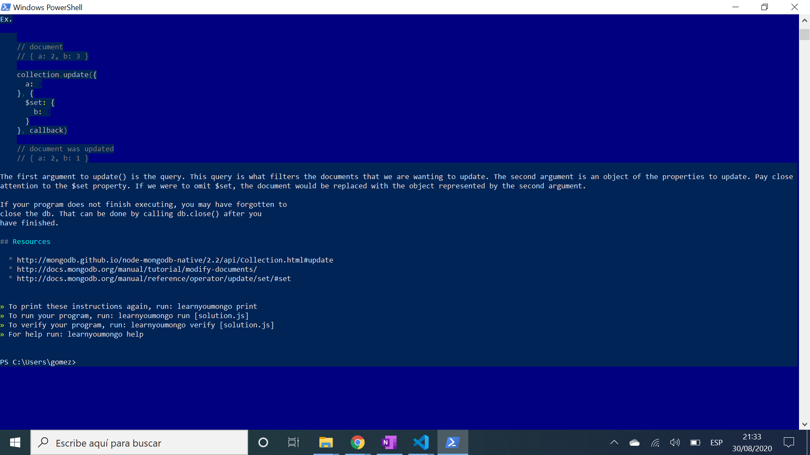

# :zap: Learn MongoDB Exercises

* Exercises to learn MongoDB

**\* Note: to open web links in a new window use: _ctrl+click on link_**

## :page_facing_up: Table of contents

* [:zap: Learn MongoDB Exercises](#zap-learn-mongodb-exercises)
	* [:page_facing_up: Table of contents](#page_facing_up-table-of-contents)
	* [:books: General info](#books-general-info)
	* [:camera: Screenshots](#camera-screenshots)
	* [:signal_strength: Technologies](#signal_strength-technologies)
	* [:floppy_disk: Setup](#floppy_disk-setup)
	* [:computer: Code Examples](#computer-code-examples)
	* [:cool: Features](#cool-features)
	* [:clipboard: Status & To-Do List](#clipboard-status--to-do-list)
	* [:clap: Inspiration](#clap-inspiration)
	* [:envelope: Contact](#envelope-contact)

## :books: General info

* Originally run in Glitch
* This repo is just a record of the javascript solutions to npm module `learnyoumongo`

## :camera: Screenshots

.

## :signal_strength: Technologies

* [Node v12](https://nodejs.org/en/) javaScript runtime built on Chrome's V8 JavaScript engine
* [Express v5](https://expressjs.com/) Fast, unopinionated, minimalist web framework for Node.js
* [learnyoumongo v3](https://www.npmjs.com/package/learnyounode) intro. to Node.js via a set of self-guided workshops

## :floppy_disk: Setup

* Run `npm run start` or `node server.js` for a dev server
* Navigate to `http://localhost:4000/` (or other port selected/default port 3000) for home screen
* The app will not automatically reload if you change any of the source files.
* learnyoumongo can be installed in Windows PowerShell or other command line using `npm i learnyoumongo -g`. It is run by typing `learnyoumongo`

## :computer: Code Examples

* extract from `count.js` to count parrots in parrots collection with age greater than a specified value. This may cause errors on later versions of MongoDB

```javascript
mongo.connect(url, function (err, db) {
	if (err) throw err;
	var parrots = db.collection('parrots');
	parrots.count(
		{
			age: {
				$gt: age,
			},
		},
		function (err, data) {
			if (err) throw err;
			console.log(data);
			db.close();
		}
	);
});
```

## :cool: Features

* Learnyoumongo can be run easily from any command prompt

## :clipboard: Status & To-Do List

* Status: Working
* To-Do: nothing

## :clap: Inspiration

* [Node.js MongoDB Driver API Methods](http://mongodb.github.io/node-mongodb-native/2.2/api/Collection.html#update)

## :envelope: Contact

* Repo created by [ABateman](https://www.andrewbateman.org) - you are welcome to [send me a message](https://andrewbateman.org/contact)
